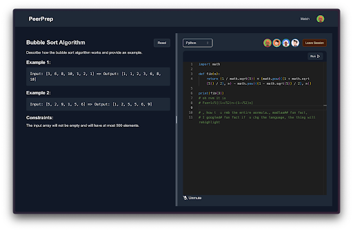
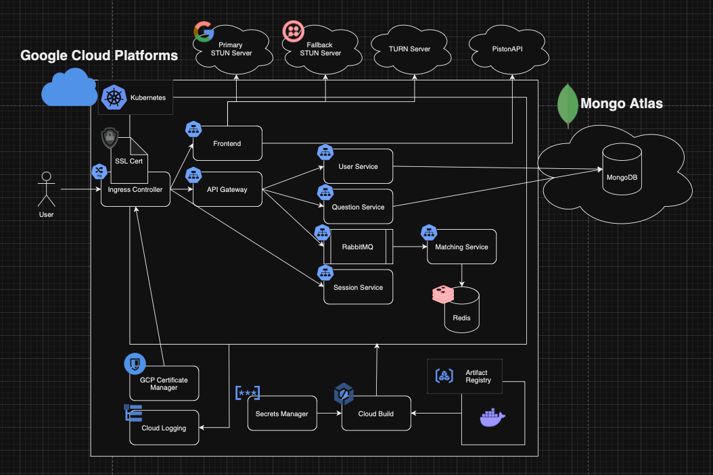

[](https://classroom.github.com/a/bzPrOe11)
# CS3219 Project (PeerPrep) - AY2425S1
## Group: G11



## Description
PeerPrep is your go-to platform for collaborative learning and problem-solving. Connect with peers at your proficiency level to tackle curated questions, improve your skills, and collaborate seamlessly using our real-time audio chat and code editor. Find the perfect study partner, learn effectively, and level up your problem-solving with PeerPrep!

Try out [PeerPrep](https://peerprep-mock-interview.duckdns.org) now!

## Features
1. Curated questions for every topic and proficiency level
2. Real-time peer matching
3. Persistent session recovery for accidental disconnects
4. Live collaboration on code editor, with syntax highlighting supported
5. Peer-to-peer audio chat support
6. Secure authentication with OAuth support
7. Multi-language code execution. (C++, Python and Java)

## Architecture


### Tech stack
- **Frontend**: Nextjs, TailwindCSS, Shadcn, Zustand, Socket.io
- **Backend**: Node, Express, Redis
- **Database**: MongoDB
- **Cloud**: Kubernetes, Docker, GCP
- **CI/CD**: Github Actions, Google Cloud Run
- **Message Broker**: RabbitMQ
- **Logging**: Google Cloud Logging
- **Audio Chat**: WebRTC, Turn, Stun
- **Secure Connection**: Google Certificate Manager, Nginx

## Setup
1. Clone the repository.
2. Install the dependencies for all services
```bash
  pnpm install
```
3. Add the required environment variables in the `.env.*` files.
4. Start the services.
```bash
  docker compose up --build
```

## Contributors
- [Kurt](https://kurt-lee.me)
- [Simba](https://www.yipsinhang.xyz/)
- [Siyuan](https://leesiyuan.me/)
- [Youwei](https://github.com/tyouwei)
- [Zhen Dong](https://github.com/ZD292)
